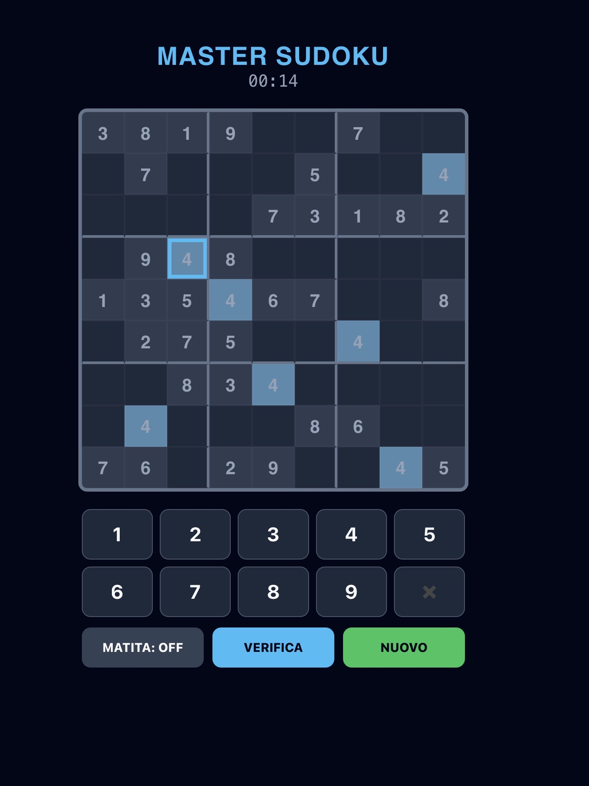

# MasterSudoku

MasterSudoku è una versione moderna e “zen” del classico Sudoku 9x9, con generazione automatica delle griglie e interfaccia ottimizzata per mobile e desktop. L’obiettivo è completare il puzzle nel minor tempo possibile rispettando le regole del Sudoku.

Il gioco include:
- Generazione automatica di puzzle sempre diversi
- Timer in tempo reale per misurare la performance
- Modalità matita per inserire note nei singoli celle
- Tastierino numerico touch e supporto tastiera fisica
- Evidenziazione celle selezionate e numeri uguali
- Verifica soluzione con feedback sugli errori
- Numpad dinamico con tasti disabilitati quando il numero è completato
- Esperienza responsive e ottimizzata per mobile

È collegato alla repository centrale MasterGames (https://mastersabba.github.io/MasterSabba/), piena di altri minigame.

